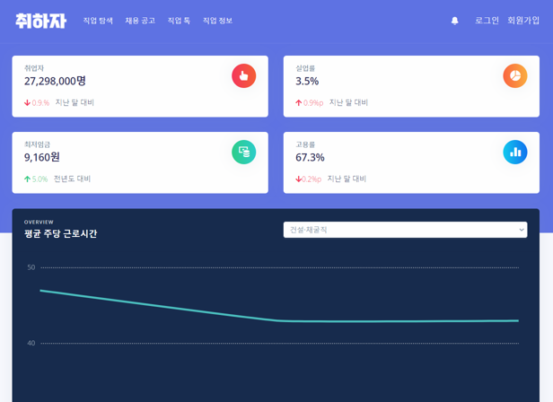
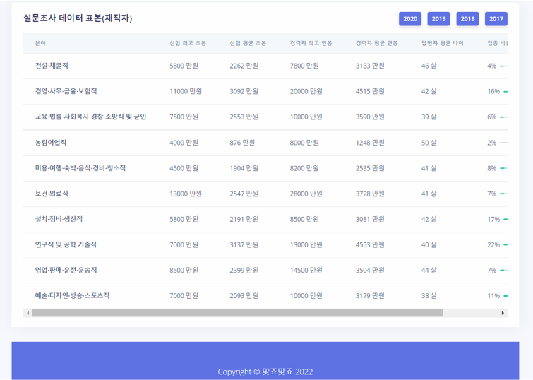
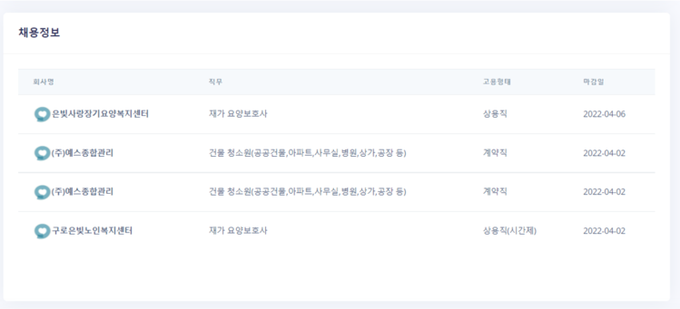
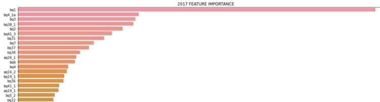
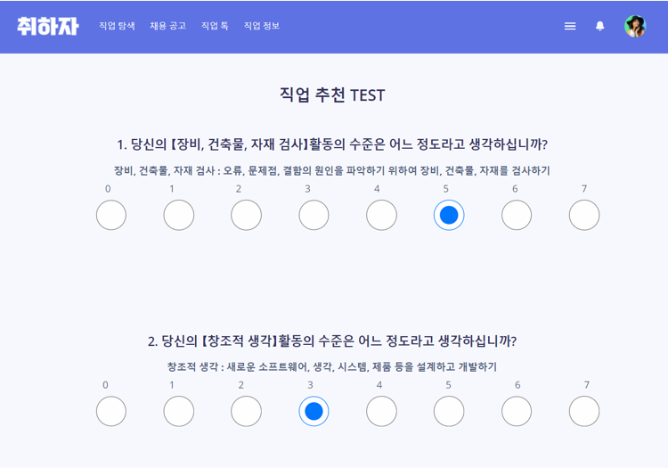
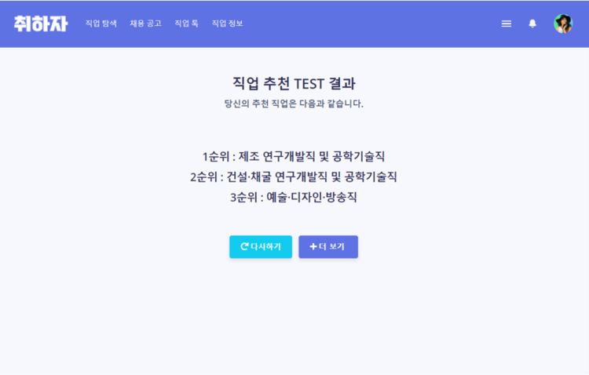
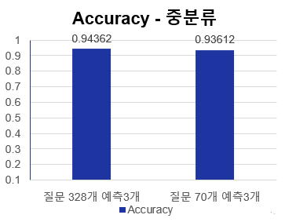
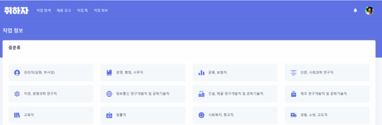

# 취하자 - 직업 추천 웹사이트

## 🔎 Introduction
한국고용정보원 재직자 설문조사 데이터 기반으로 제작된 웹사이트 입니다.  
https://github.com/PancakeCookie/DACON-Job-Recommendation-Competition

## 💻 기술 스택
- Front-end : Bootstrap  
- Back-end : django  
- DB : MySQL  
- 배포 : AWS EC2, S3, RDS  

## ✨ 기능 
- 회원가입, 로그인, 로그아웃, 회원정보수정
- 직업 통계, 고용지표  
- 직업 추천 설문 
- 직업 정보(워크넷 연동)
- 추천 직업 기반 일자리 정보 제공

### 메인 페이지
- 직업 통계, 고용지표 

### 추천 직업 기반 일자리 정보 제공
- 서울시 일자리 포탈 api 이용하여 추천된 직업과 관련된 일자리 정보 제공

### 직업 추천 설문 
- 4개년도(2017~2020) 질문 통합  
- 통합된 질문 328개 중에 FEATURE IMPORTANCE가 높은 질문 및 구직자가 대답할 수 있는 질문 70개를 간추려 제작

     
### 직업 추천 결과 
- 기존의 약 600개의 직업을 중분류 34개로 통합(한국고용직업분류(KECO) 2018 기준)  

 

- 상위 3개 직업 추천시 Accuracy 약 94%
 

### 직업 정보(워크넷 연동)
 

